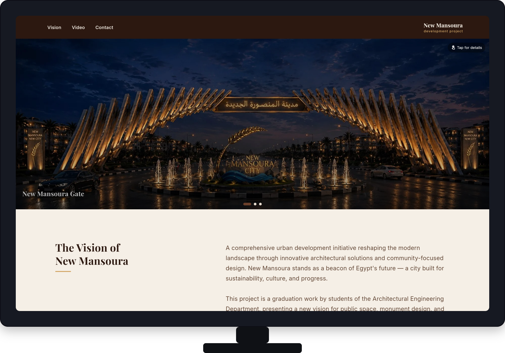
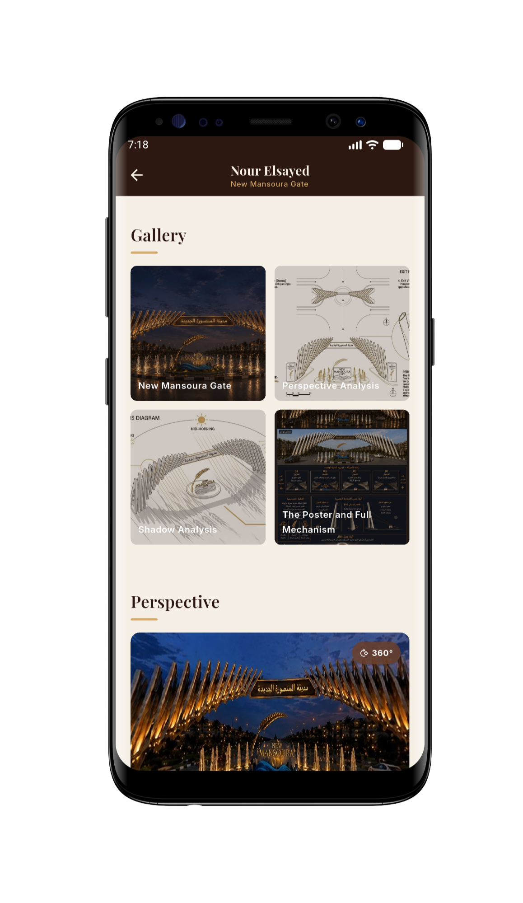

# 🏛️ New Mansoura Development Project 

A premium, ultra-responsive architectural showcase and interactive landing page built with **Flutter**. This project functions as a high-performance Single Page Application (SPA) designed to present architectural renders, 360° panoramas, and promotional media with a fully custom, high-end design system.

---

## 🚀 Live Demo
🔗 [Explore the Live Architectural Showcase](new-mansoura-arch-29.netlify.app)

---

## 📸 Architectural Previews & UI/UX

<!-- Tip: Place your shots.so mockups or screen recordings here -->
| 🖥️ Premium Desktop Experience | 📱 Flawless Mobile Responsiveness |
| --- | --- |
|  |  |

---

## ✨ Core Features & Web Optimizations

### 1. Interactive Landing Page (Home View)
*   **Hero Carousel Section:** An automated, fluid image slider displaying high-quality architectural renders linked to descriptive media detail dialogs.
*   **Smooth Section Scrolling:** Navigation via Custom AppBar & Drawer utilizing `Scrollable.ensureVisible` coupled with a micro-delayed feedback loop for an ultra-smooth native scrolling experience.
*   **WASM-Compatible Custom Video Player:** Features an asset video player utilizing `video_player` with fully customized playback controls. Implements a specialized transparent overlay hack to intercept and prevent native browser DOM `<video>` elements from swallowing gesture events.

### 2. Deep Portfolio Portals (Member View)
*   **Team Member Grid:** A modular showcase of the architectural team, leading to dedicated portfolio views.
*   **Immersive 360° Perspective:** Integrated spherical panorama engine (`panorama_viewer`) supporting drag-to-look features and a fully immersive full-screen presentation dialog.
*   **Masonry Project Gallery:** Dynamic layout distribution highlighting high-fidelity renders attributed to specific designers.

### 3. Engineering & UX Micro-details
*   **Advanced Motion Controls:** Dialog popups leverage coupled `FadeTransition` and `ScaleTransition` interpolating via bounce-back elastic curves (`Curves.easeOutBack`).
*   **Cursor Interactions:** Comprehensive use of `MouseRegion` to control pointer physics, hover micro-animations, and context-aware cursor modifications (`SystemMouseCursors`).

---

## 🛠️ Architecture & Tech Stack

This project is engineered according to scalable, production-ready development standards:

*   **State Management:** BLoC / Cubit pattern for lightweight, decoupled UI state and navigation lifecycle management.
*   **Architecture:** Feature-driven architecture, strictly isolating `core` shared layers from independent business `features` (home, member).
*   **Responsiveness:** Dynamic layout engine (`ResponsiveHelper`) calculating runtime scaling transformations across Mobile, Tablet, and Desktop breakpoints.

---

## 📦 Getting Started & WASM Build Compilation

To set up the environment locally or compile the web distribution with maximum near-native performance using **WebAssembly (WASM)**, execute the following commands:

```bash
# 1. Clone the architectural repository
git clone [https://github.com/mohamedazzam36/new_mansoura_arch_project](https://github.com/mohamedazzam36/new_mansoura_arch_project)

# 2. Fetch dependencies
flutter pub get

# 3. Execute locally with WASM engine alignment
flutter run -d chrome --wasm

# 4. Compile optimized release bundle (Generates optimized WASM + JS fallbacks)
flutter build web --wasm
